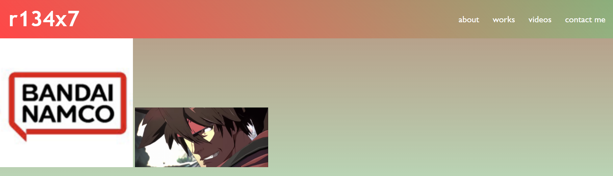

# HW02-Advanced-CSS-Portfolio

Advanced CSS: Portfolio

This is a webpage to show off my portfolio. It contains the following sections: about, works, videos and a contact me. The webpage is mobile-friendly with a responsive layout where the works/video images change size/position and the text changes position according to the resolution settings.

Link to deployed application: [https://r134x7.github.io/My-Portfolio/](https://r134x7.github.io/My-Portfolio/)

This is only a screenshot: 

